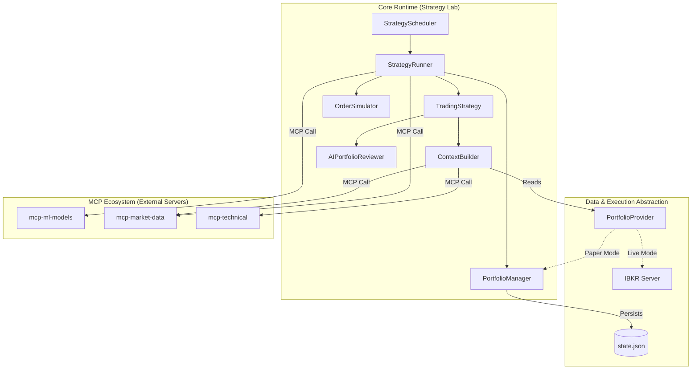

# Nexus Trading - Architecture
> **Strategy Lab MVP**

## 🏗️ Diagrama de Componentes

## 🧩 Componentes Clave

### 1. StrategyRunner (`src/strategies/runner.py`)
El cerebro operativo. Orquesta el ciclo de vida de una ejecución:
1.  Consulta el régimen de mercado (MCP ML).
2.  Obtiene datos de mercado actuales (MCP Market Data).
3.  Injecta el contexto a la estrategia.
4.  Recibe señales y las pasa al simulador/ejecutor.

### 2. ContextBuilder (`src/agents/llm/context_builder.py`)
Responsable de construir la "visión del mundo" para el Agente IA.
*   **Unificación**: Agrega datos de Mercado, Técnico, Régimen y **Portfolio**.
*   **Abstracción**: Usa `PortfolioProvider` para ser agnóstico del origen de los datos de cuenta (Paper vs Live).

### 3. PortfolioProvider (`src/trading/paper/provider.py`)
Interface (ABC) que desacopla la lectura de datos de cartera.
*   **PaperPortfolioProvider**: Lee del `PaperPortfolioManager` local.
*   **LivePortfolioProvider** (Futuro): Leerá del MCP IBKR.

### 4. AIPortfolioReviewer (`src/agents/llm/portfolio_reviewer.py`)
Un agente especializado (basado en Claude) que NO busca nuevas entradas, sino que evalúa exclusivamente las posiciones abiertas para decidir: `HOLD`, `CLOSE` o `ADJUST`.

## 🔄 Flujo de Datos

1.  **Trigger**: `StrategyScheduler` despierta al `Runner` con un `strategy_id`.
2.  **Context**: `Runner` compila precios, indicadores y régimen.
3.  **Decision**: `Strategy` (HMM u Agente) procesa el contexto -> `Signal`.
4.  **Execution**: `Runner` pasa la `Signal` al `OrderSimulator`.
5.  **Persistence**: `PortfolioManager` actualiza el estado en memoria y guarda en disco.
6.  **Reporting**: Al finalizar, `CSVReporter` vuelca el estado final a archivos.
