# Manual Operativo: Nexus Trading (Fase Paper Trading)

> **Objetivo**: Guía completa para entender y operar el bot durante la validación de 30 días en Paper Trading.

---

## 1. Visión General
Durante los próximos 30 días, el **Strategy Lab** operará de forma autónoma simulando un entorno real. El sistema ejecutará dos estrategias en paralelo, cada una con su propio capital virtual (€25,000 c/u), compitiendo y operando sobre el mismo mercado.

### 🔄 El Ciclo de Vida Diario
El bot funciona como un servicio continuo ("daemon"). No necesitas ejecutarlo manualmente cada vez; el **Scheduler** interno se encarga de despertar a las estrategias.

```mermaid
graph TD
    Start((Inicio)) --> Init[Inicialización Sistema]
    Init --> Scheduler{Scheduler Esperando}
    
    Scheduler -->|Cron 10:00| HMM[Ejecutar HMM Rules]
    Scheduler -->|Cada 4h| AI[Ejecutar AI Agent]
    
    subgraph "Ejecución de Estrategia"
        HMM --> Contexto[Obtener Datos & Régimen]
        AI --> Contexto
        Contexto --> Decision[Generar Señales]
        Decision --> Ordenes[Simulador de Órdenes]
        Ordenes --> Persistencia[(Guardar Portfolio)]
    end
    
    Persistencia --> Scheduler
    
    Scheduler -->|Fin del Día / Stop| Reporte[Generar CSV Diario]
```

---

## 2. Configuración y Selección de Activos

### ¿Qué activos opera el bot?
Los símbolos se definen en el archivo `config/strategies.yaml`.
*   **HMM Rules Strategy**: Opera una lista fija de ETFs representativos (ej. `SPY`, `QQQ`, `IWM`).
*   **AI Agent Swing**: Tiene flexibilidad para operar estos mismos símbolos, enfocándose en un análisis más profundo.

> **Nota**: En esta fase MVP, los símbolos son estáticos. En fases futuras, el `UniverseManager` inyectará símbolos dinámicamente.

---

## 3. Las Dos Estrategias en Juego

### 🤖 A. HMM Rules Strategy (El Sistemático)
Esta estrategia es puramente matemática. No "piensa", sigue reglas estrictas basadas en el **Régimen de Mercado**.

1.  **Detecta el Régimen**: Consulta al modelo ML (HMM) para saber si el mercado está `BULL`, `BEAR` o `SIDEWAYS`.
2.  **Aplica Reglas**:
    *   Si es **BULL**: Busca correcciones (RSI bajo) para comprar ("Buy the Dip").
    *   Si es **SIDEWAYS**: Compra en soporte y vende en resistencia ("Mean Reversion").
    *   Si es **BEAR**: Se mantiene en efectivo (Cash) o cierra posiciones.
3.  **Gestión**: Usa Stop Loss y Take Profit fijos (configurados en YAML).

### 🧠 B. AI Agent Swing (El Inteligente)
Esta estrategia usa un LLM (Claude) para tomar decisiones discrecionales, imitando a un trader humano.

1.  **Analiza Contexto**: Recibe un "prompt" gigante con precios, indicadores técnicos, noticias (simulado) y estado de su cartera.
2.  **Razona**: El modelo evalúa la situación y decide:
    *   *¿Entrar Long?*
    *   *¿Mantener?*
    *   *¿Cerrar por riesgo?*
3.  **Reviewer**: Periódicamente, un agente "Risk Manager" revisa solo las posiciones abiertas para decidir si cerrarlas, independientemente de nuevas entradas.

---

## 4. Gestión de Capital y Persistencia

### 💰 Capital Separado
El sistema usa un **PaperPortfolioManager** que actúa como un banco central para las estrategias.
*   **Cuenta 'hmm_rules'**: Inicia con €25,000.
*   **Cuenta 'ai_agent_swing'**: Inicia con €25,000.

Las ganancias o pérdidas de una estrategia **NO** afectan a la otra. Están totalmente aisladas.

### 💾 ¿Cómo se guarda el progreso?
Cada vez que el bot realiza una operación (compra/venta), el estado se guarda instantáneamente en disco.
*   **Archivo**: `data/paper_portfolios.json`
*   **Seguridad**: Si el ordenador se apaga o el script se detiene, al reiniciar **recuperará las posiciones y el dinero exacto** donde lo dejó.

---

## 5. Monitorización: ¿Cómo sé qué está pasando?

No necesitas mirar la consola todo el día. El sistema genera "evidencia" en dos lugares:

### A. Logs (En tiempo real)
El archivo `strategy_lab.log` (o la consola si lo tienes abierto) mostrará:
*   `INFO`: "Programada estrategia..." (El bot está vivo).
*   `INFO`: "Executing strategy..." (Ha empezado a analizar).
*   `INFO`: "Signal generated: BUY SPY..." (¡Ha decidido comprar!).
*   `INFO`: "Order FILLED..." (Compra realizada con éxito).

### B. Reportes Diarios (Resumen)
Al final de cada sesión (o cuando detienes el bot), se genera una carpeta en `reports/YYYY-MM-DD/` con dos archivos CSV clave:

1.  **`portfolio_summary.csv`**: Tu estado de cuenta.
    *   *Columnas*: `strategy_id`, `total_value` (cuánto tienes ahora), `cash`.
    *   *Uso*: Abre este archivo para ver si estás ganando o perdiendo dinero día a día.

2.  **`positions.csv`**: Qué tienes comprado.
    *   *Columnas*: `symbol`, `quantity`, `avg_price`, `entry_time`.
    *   *Uso*: Para ver en qué está invertido cada bot actualmente.

---

## 6. Tu Rutina de Supervisión

Para los 30 días de prueba, tu rol es de **Supervisor**:

1.  **Arrancar**: Ejecuta `python scripts/run_strategy_lab.py` y déjalo correr en segundo plano.
2.  **Verificar**: Una vez al día, revisa la carpeta `reports/` de la fecha actual.
    *   ¿Se generaron los archivos? (Significa que el bot funcionó).
    *   ¿Ha cambiado el `total_value`? (Hubo mercado).
3.  **Mantenimiento**: Si necesitas reiniciar el PC, simplemente cierra el script (Ctrl+C espera al shutdown limpio) y vuelve a arrancarlo al encender. El estado se recuperará solo.
