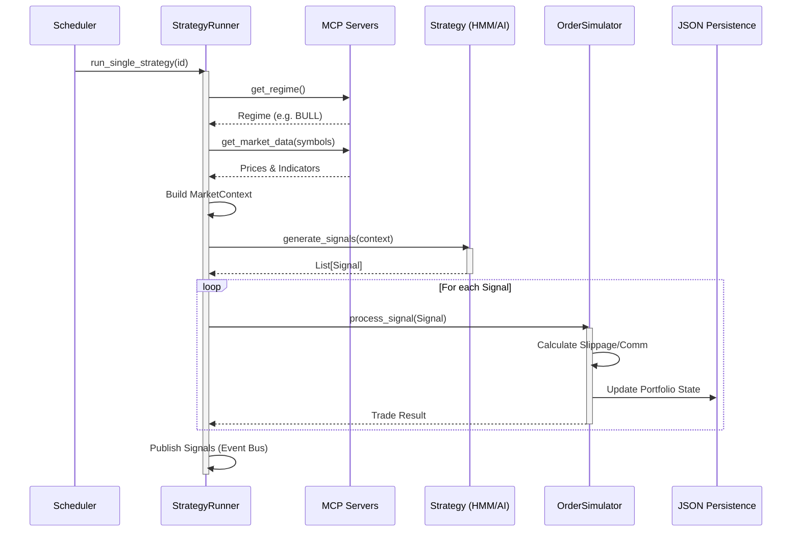
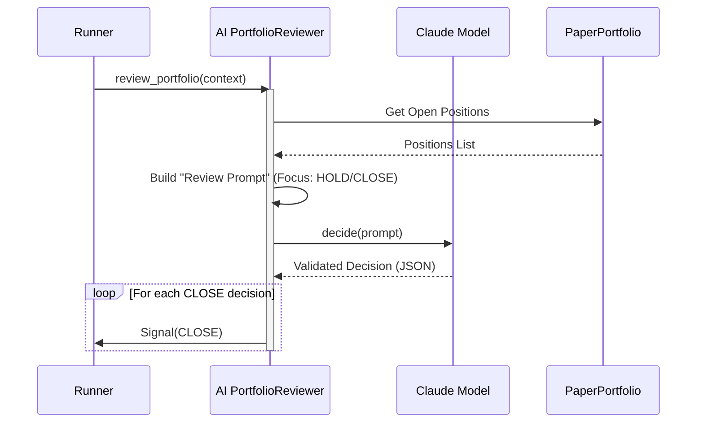
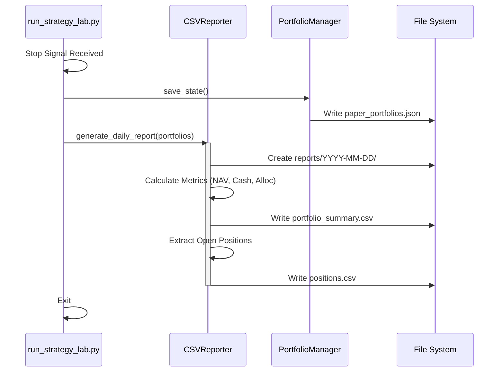

# Nexus Trading - Workflows
> **Secuencias de Ejecución del Strategy Lab**

## 1. Ciclo de Ejecución de Estrategia

Flujo estándar disparado por el Scheduler.

## 2. Flujo de Revisión de Portfolio (AI Agent)

Proceso específico donde el Agente audita posiciones existentes.

## 3. Generación de Reportes Diarios

Se ejecuta al detener el servicio o al cambio de día.

